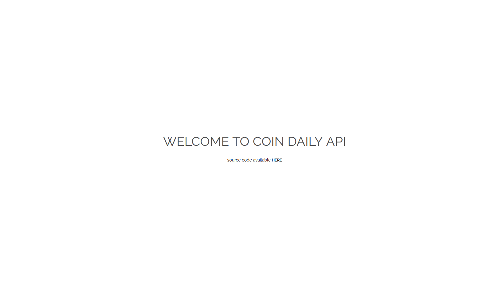

# Coin Daily API
<kbd>
	
</kbd>

<br><br>

- API for frontend app
- Express Framework - Node.js
- MongoDB

Built for [coin daily frontend app](https://github.com/Nabil5352/coin-daily)

#### Environment variables:
```
CDA_JWT_TOKEN (Private key - Mandatory)
DBSTRING (MongoDB connection string - Mandatory)
NODE_ENV (optional, default: dev)
PORT (optional, default: 4000)
```